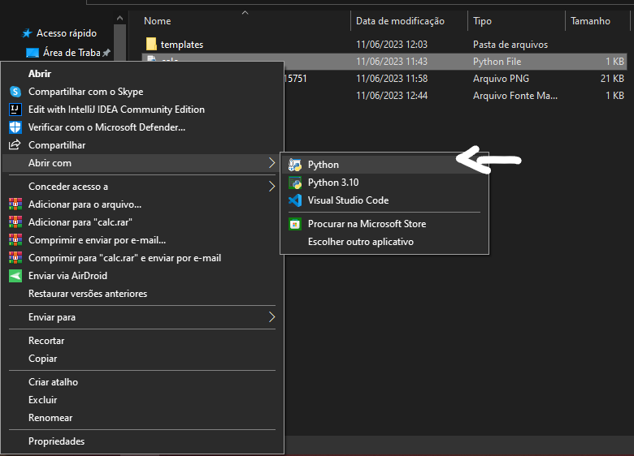
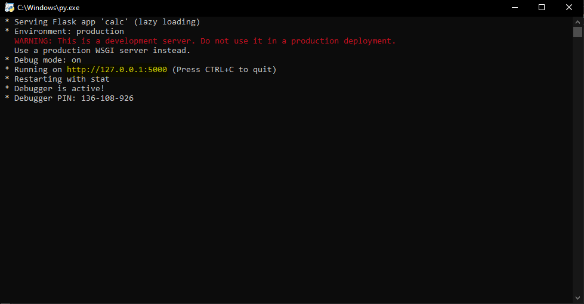

Calculadora utilizando o framework Flask, de Python.
Desenvolvido por Jean H. e Marcelo D. com base em outras calculadoras já existentes, com algumas adaptações.
Para executar é necessário rodar o arquivo calc.py. A forma que usamos foi abrindo o arquivo com o aplicativo do python:

 

Em seguida irá abrir uma tela do "cmd" onde encontraremos um ip que é onde está rodando a calculadora (em amarelo na imagem abaixo):

 

Copie o ip e cole-o no seu navegador.